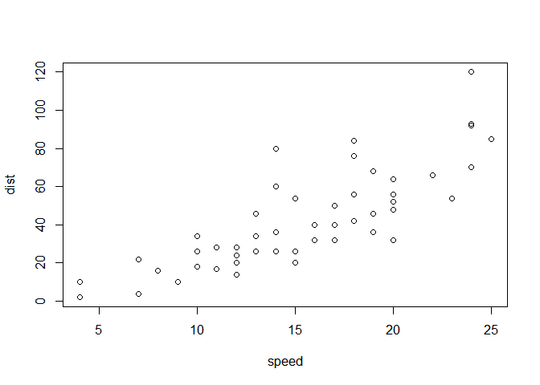

# Intro

A lot of data has suppression techniques applied due to small populations.

We often have values in the margins of the table but not in the individual table cells. This usually occurs with geographic areas. For example, we could have data on the state but not on the individual counties. It can also occur with categorical variables like age group. In the case of having the overall unemployment rate within a county but not having the unemployment rate broken down by age groups.

We can think of the usual case where these two situations occur together: we want to know the unemployment rate by age-groups within each county; however, we only have data on the total unemployment rate in each county and the unemployment rates for each age-group within the state as a whole.

There are three additional things to consider:

1. We may have some of the cells of the table. For example, the CDC often publishes data, such as infant mortality rates, on counties within urban areas but not on every county.
2. We may have extra covariates that are known to correlate well with the piece of data we are interested in. For example, we may know average education levels within each county and that is (weakly) predictive of the unemployment rate.
3. Even the data we have -- in this example the marginal unemployment rates -- might be measured with error. Therefore, the given data might have confidence intervals or standard errors.

This vignette will use iterative proportional fitting to un-supperess the cells of a table. I will demonstrate what to do under the first consideration -- having some cell values -- but leave the 2nd and 3rd issues for the advanced vignette.

First I will make a toy-data example to show the maths.

Then I will use infant, child, and adult mortality rate data from the CDC to demonstrate the more complicated example.

# R setup

As usual with R, there are multiple packages that do almost exactly the same thing. I chose to use the `mipfp` package instead of `ipfp` because it makes more sense to me. See [this subsection](https://spatial-microsim-book.robinlovelace.net/smsimr.html#compareipf) of a e book about spatial microsimulation for a brief comparison of the performance of the two packages.


```r
# data manipulation stuff
library(tidyr)
library(reshape2)
```

```
## 
## Attaching package: 'reshape2'
```

```
## The following object is masked from 'package:tidyr':
## 
##     smiths
```

```r
library(dplyr)
```

```
## 
## Attaching package: 'dplyr'
```

```
## The following objects are masked from 'package:stats':
## 
##     filter, lag
```

```
## The following objects are masked from 'package:base':
## 
##     intersect, setdiff, setequal, union
```

```r
library(tibble)

# iterative proportional fitting
library(mipfp)
```

```
## Loading required package: cmm
```

```
## Loading required package: Rsolnp
```

```
## Loading required package: numDeriv
```

```
## 
## Attaching package: 'mipfp'
```

```
## The following object is masked from 'package:tidyr':
## 
##     expand
```

```r
# I re-wrote the main fitting function to accomadate the situation of
# having some cells within the table fixed to values.
source("code/ipfp_fixed_cells.R")

# integerization functions
# download from https://github.com/Robinlovelace/spatial-microsim-book
source("code/spatial-microsim-book-functions.R")
```

# First Example

## Make data

We are calling this the "toy" data. I made up all the numbers.


```r
s = rep( c('Alaska', 
           'Nebraska', 
           'Tennessee', 
           'Wisconsin'
           ),
         5)


toy <- data_frame(place = s,
                  age   = rep(1:5, 4),
                  incidents = c( 15, 9, 10, 7, 1,
                                 35, 28, 21, 14, 2,
                                 45, 20, 15, 19, 1,
                                 50, 25, 20, 25, 0
                                 ),
                  population = c( 2000, 5600, 3400, 1000, 3000,
                                  2333, 2599, 3602, 1901, 3550,
                                  2277, 2209, 4200, 1764, 7000,
                                  2097, 2001, 4104, 1987, 6400
                                  )
                  )

toy = mutate(toy, rate = incidents / population)
                                    
str(toy)
```

```
## Classes 'tbl_df', 'tbl' and 'data.frame':	20 obs. of  5 variables:
##  $ place     : chr  "Alaska" "Nebraska" "Tennessee" "Wisconsin" ...
##  $ age       : int  1 2 3 4 5 1 2 3 4 5 ...
##  $ incidents : num  15 9 10 7 1 35 28 21 14 2 ...
##  $ population: num  2000 5600 3400 1000 3000 ...
##  $ rate      : num  0.0075 0.001607 0.002941 0.007 0.000333 ...
```

```r
print(toy)
```

```
## # A tibble: 20 x 5
##    place       age incidents population     rate
##    <chr>     <int>     <dbl>      <dbl>    <dbl>
##  1 Alaska        1        15       2000 0.0075  
##  2 Nebraska      2         9       5600 0.00161 
##  3 Tennessee     3        10       3400 0.00294 
##  4 Wisconsin     4         7       1000 0.007   
##  5 Alaska        5         1       3000 0.000333
##  6 Nebraska      1        35       2333 0.0150  
##  7 Tennessee     2        28       2599 0.0108  
##  8 Wisconsin     3        21       3602 0.00583 
##  9 Alaska        4        14       1901 0.00736 
## 10 Nebraska      5         2       3550 0.000563
## 11 Tennessee     1        45       2277 0.0198  
## 12 Wisconsin     2        20       2209 0.00905 
## 13 Alaska        3        15       4200 0.00357 
## 14 Nebraska      4        19       1764 0.0108  
## 15 Tennessee     5         1       7000 0.000143
## 16 Wisconsin     1        50       2097 0.0238  
## 17 Alaska        2        25       2001 0.0125  
## 18 Nebraska      3        20       4104 0.00487 
## 19 Tennessee     4        25       1987 0.0126  
## 20 Wisconsin     5         0       6400 0
```

```r
## heres the 2-way table
toy_tbl <- toy %>% 
             select(place, age, incidents) %>%
             spread(age, incidents)
```

At this point we need to find a good way to make the "marginal" sums for incidents and population by both place and age. Whatever approach we use should generalize to any table with 2 factors (e.g. place and age) and any two variables used for the numerator (incidents) and denominator (population).

**TODO** Figure out a smart way to integrate tidy data principles with the list objects and arrays that the functions expect. The idea of "marginals" seems antithetical to Tidy data, so let's just make separate data frames for each of the marginals.


```r
place_marginals <- toy %>%
                     group_by(place) %>%
                     summarise(incidents = sum(incidents),
                               population = sum(population)
                               )

place_marginals$rate <- place_marginals$incidents / place_marginals$population


age_marginals <- toy %>%
                   group_by(age) %>%
                   summarise(incidents = sum(incidents),
                             population = sum(population)
                             )

age_marginals$rate <- age_marginals$incidents / age_marginals$population
```

## Suppress data

We throw out some data. In the future this could be improved by coming up with a way to suppress the "smallest" counts/values, but the IPF methods are the same. I picked which cells to suppress.


```r
selected_cells <- rbind(c("Alaska", 3),
                        c("Alaska", 4),
                        c("Alaska", 5),
                        c("Nebraska", 1),
                        c("Nebraska", 2),
                        c("Nebraska", 3),
                        c("Nebraska", 5),
                        c("Tennessee", 1),
                        c("Wisconsin", 2)
                        )

# for loops make me nervous so make edits on a copy
foo <- toy

for ( i in 1:nrow(foo) ) {
  for ( j in 1:nrow(selected_cells) ) {
    if ( foo[i,1] == selected_cells[j,1] & foo[i,2] == selected_cells[j,2] ){
      foo[i,"incidents"] <- NaN
      foo[i,"rate"] <- NaN
    }
  } 
}

toy_suppressed <- foo
print(toy_suppressed)
```

```
## # A tibble: 20 x 5
##    place       age incidents population       rate
##    <chr>     <int>     <dbl>      <dbl>      <dbl>
##  1 Alaska        1        15       2000   0.0075  
##  2 Nebraska      2       NaN       5600 NaN       
##  3 Tennessee     3        10       3400   0.00294 
##  4 Wisconsin     4         7       1000   0.007   
##  5 Alaska        5       NaN       3000 NaN       
##  6 Nebraska      1       NaN       2333 NaN       
##  7 Tennessee     2        28       2599   0.0108  
##  8 Wisconsin     3        21       3602   0.00583 
##  9 Alaska        4       NaN       1901 NaN       
## 10 Nebraska      5       NaN       3550 NaN       
## 11 Tennessee     1       NaN       2277 NaN       
## 12 Wisconsin     2       NaN       2209 NaN       
## 13 Alaska        3       NaN       4200 NaN       
## 14 Nebraska      4        19       1764   0.0108  
## 15 Tennessee     5         1       7000   0.000143
## 16 Wisconsin     1        50       2097   0.0238  
## 17 Alaska        2        25       2001   0.0125  
## 18 Nebraska      3       NaN       4104 NaN       
## 19 Tennessee     4        25       1987   0.0126  
## 20 Wisconsin     5         0       6400   0
```

## Unsuppress data

The `mipfp` package doesn't know how to deal with the situation where some of the cells still have data, so we use a two stage approach to unsuppress the specified cells.

To deal with this I altered the code in the `mipfp::Ipfp()` function by changing two things:

1. Each iteration of IPF uses an "update factor" that gets multiplied through the matrix - first by row and then by columns. The update factor is calculated as the ratio fo the target marginals divided by the sum of the row/column from the previous iteration. (For the fist iteration, the sum is across the row/column of the seed matrix.) Obviously what we need to do is "remove" the fixed cells when the algorithm calculates the update factor. It's a bit of arithmetic, but straightforward in the code. 
2. Second, after the algorithm multiplies its update factors, we need to reset the fixed cells to there fixed values. This means that as the algorithm goes to start the next iteration, the fixed cells will be reset back to their original values and are thus not iteratively "raked" to the margins.


```r
## convert the suppressed data into a matrix format because that's what Ipfp() wants
toy_suppressed_tbl <- toy_suppressed %>% 
                        select(place, age, incidents) %>%
                        spread(age, incidents)

toy_suppressed_mat <- as.matrix(toy_suppressed_tbl[,-1])

## TODO double check and then delete this _mat_zeros thing?
## eventually we'll need a version of the matrix with zeros instead of NaN
## so we might as well create that now
## toy_suppressed_mat_zeros <- toy_suppressed_mat
## toy_suppressed_mat_zeros[is.na(toy_suppressed_mat)] <- 0

## make a matrix of all 1s with same dimensions as the toy data
## this is the worst possible seed matrix so we are testing with it first
toy_seed <- array(data = 1,
                  dim = c(nrow(toy_suppressed_mat),
                          ncol(toy_suppressed_mat)
                          )
                  )

##############################################################################
## TODO after I run the real data and it works ok, we can get rid of this
## experimentation with the seed matrix?
## let us try to make a better seed
remainder <- sum(place_marginals$incidents) - sum(toy_suppressed_mat, na.rm = TRUE)
toy_seed_2 <- as.array(toy_suppressed_mat)

default_seed <- remainder / sum(is.na(toy_seed_2))

## the algo wants to add up from below it seems so the seed should under
## guess the values across the board
seed_constant <- 2

toy_seed_2[is.na(toy_seed_2)] <- default_seed - seed_constant

##############################################################################

## the marginals go in a list for Ipfp()
toy_target <- list(as.array(place_marginals$incidents),
                   as.array(age_marginals$incidents)
                   )

## this tells the Ipfp() function which is rows and which is columns
toy_target_design <- list(1,2)

toy_result_no_fix <- Ipfp(toy_seed,
                          toy_target_design,
                          toy_target,
                          print = TRUE
                          )
```

```
## Margins consistency checked!
## ... ITER 1 
##        stoping criterion: 42.66022 
## ... ITER 2 
##        stoping criterion: 7.105427e-15 
## Convergence reached after 2 iterations!
```

```r
## here are the error RATES
round(( toy_result_no_fix$x.hat - toy_tbl[,-1] ) / toy_tbl[,-1],
      2
      )
```

```
##       1     2     3     4     5
## 1  0.87 -0.37 -0.15 -0.10 -0.23
## 2 -0.03  1.14 -0.23 -0.20 -0.53
## 3 -0.03 -0.12  0.99 -0.22  0.20
## 4 -0.21  0.11 -0.15  1.51   Inf
```

```r
## those are crazy big errors. 

## my function expects this matrix to have values where the cells should
## be fixed. for cells that are allowed to change, they will have NaN's.
## Ipfp() uses arrays and lists so I guess keep using arrays?
fixed_cells = array(data = toy_suppressed_mat,
                    dim = dim(toy_suppressed_mat)
                    )


toy_result_fixed <- ipfp_fixed_cells(toy_seed,
                                     toy_target_design,
                                     toy_target,
                                     fixed_cells,
                                     print = TRUE
                                     )
```

```
## Margins consistency checked!
## ... ITER 1 
##        stoping criterion: 57.53659 
## ... ITER 2 
##        stoping criterion: 6.608018 
## ... ITER 3 
##        stoping criterion: 3.03995 
## ... ITER 4 
##        stoping criterion: 1.568311 
## ... ITER 5 
##        stoping criterion: 0.8907525 
## ... ITER 6 
##        stoping criterion: 0.5342209 
## ... ITER 7 
##        stoping criterion: 0.3294839 
## ... ITER 8 
##        stoping criterion: 0.2063119 
## ... ITER 9 
##        stoping criterion: 0.1303312 
## ... ITER 10 
##        stoping criterion: 0.08277962 
## ... ITER 11 
##        stoping criterion: 0.05275715 
## ... ITER 12 
##        stoping criterion: 0.03369682 
## ... ITER 13 
##        stoping criterion: 0.02155313 
## ... ITER 14 
##        stoping criterion: 0.01379843 
## ... ITER 15 
##        stoping criterion: 0.008839094 
## ... ITER 16 
##        stoping criterion: 0.00566439 
## ... ITER 17 
##        stoping criterion: 0.00363083 
## ... ITER 18 
##        stoping criterion: 0.002327698 
## ... ITER 19 
##        stoping criterion: 0.001492412 
## ... ITER 20 
##        stoping criterion: 0.0009569174 
## ... ITER 21 
##        stoping criterion: 0.000613581 
## ... ITER 22 
##        stoping criterion: 0.0003934346 
## ... ITER 23 
##        stoping criterion: 0.000252273 
## ... ITER 24 
##        stoping criterion: 0.0001617566 
## ... ITER 25 
##        stoping criterion: 0.0001037153 
## ... ITER 26 
##        stoping criterion: 6.649837e-05 
## ... ITER 27 
##        stoping criterion: 4.33891e-05 
## ... ITER 28 
##        stoping criterion: 2.88666e-05 
## ... ITER 29 
##        stoping criterion: 1.923068e-05 
## ... ITER 30 
##        stoping criterion: 1.28285e-05 
## ... ITER 31 
##        stoping criterion: 8.569128e-06 
## ... ITER 32 
##        stoping criterion: 5.731553e-06 
## ... ITER 33 
##        stoping criterion: 3.838637e-06 
## ... ITER 34 
##        stoping criterion: 2.574206e-06 
## ... ITER 35 
##        stoping criterion: 1.728474e-06 
## ... ITER 36 
##        stoping criterion: 1.162052e-06 
## ... ITER 37 
##        stoping criterion: 7.822045e-07 
## ... ITER 38 
##        stoping criterion: 5.271513e-07 
## ... ITER 39 
##        stoping criterion: 3.556783e-07 
## ... ITER 40 
##        stoping criterion: 2.402552e-07 
## ... ITER 41 
##        stoping criterion: 1.624676e-07 
## ... ITER 42 
##        stoping criterion: 1.099828e-07 
## ... ITER 43 
##        stoping criterion: 7.452986e-08 
## ... ITER 44 
##        stoping criterion: 5.055547e-08 
## ... ITER 45 
##        stoping criterion: 3.432588e-08 
## ... ITER 46 
##        stoping criterion: 2.332785e-08 
## ... ITER 47 
##        stoping criterion: 1.586758e-08 
## ... ITER 48 
##        stoping criterion: 1.080222e-08 
## ... ITER 49 
##        stoping criterion: 7.359795e-09 
## ... ITER 50 
##        stoping criterion: 5.018258e-09 
## ... ITER 51 
##        stoping criterion: 3.424189e-09 
## ... ITER 52 
##        stoping criterion: 2.338115e-09 
## ... ITER 53 
##        stoping criterion: 1.597575e-09 
## ... ITER 54 
##        stoping criterion: 1.092268e-09 
## ... ITER 55 
##        stoping criterion: 7.472352e-10 
## ... ITER 56 
##        stoping criterion: 5.114771e-10 
## ... ITER 57 
##        stoping criterion: 3.50294e-10 
## ... ITER 58 
##        stoping criterion: 2.400196e-10 
## ... ITER 59 
##        stoping criterion: 1.645404e-10 
## ... ITER 60 
##        stoping criterion: 1.128502e-10 
## ... ITER 61 
##        stoping criterion: 7.742962e-11 
## Convergence reached after 61 iterations!
```

```r
## and now we have almost no error rates:
round(( toy_result_fixed$x.hat - toy_tbl[,-1] ) / toy_tbl[,-1],
      2
      )
```

```
##   1 2     3 4     5
## 1 0 0 -0.02 0  0.26
## 2 0 0  0.01 0 -0.13
## 3 0 0  0.00 0  0.00
## 4 0 0  0.00 0   NaN
```

```r
toy_unsuppressed_mat <- toy_result_fixed$x.hat

## these should be equal
all.equal(sum(place_marginals$incidents), sum(toy_unsuppressed_mat))
```

```
## [1] TRUE
```

```r
## if you dont like the idea of fractional people (or whatever) then you
## can integerize the result but the integerization may make the overall 
## total no longer correct
toy_unsuppressed_mat_int <- int_trs(toy_unsuppressed_mat)

## in this case they are still true which means that the integerization
## algorithm did not encounter any ties
all.equal(sum(place_marginals$incidents), sum(toy_unsuppressed_mat_int))
```

```
## [1] TRUE
```


# Second Example

This is where all my work started. The CDC suppresses the death count in their mortality data any time the cell is less than 10. So when you divide up by age groups (0-1, 2-4, 5-9, etc.) and counties you get a lot of suppressed data. However, you can get counts across all counties (ie at the state-level) and across all ages. Thus we need to the IPF in order to unsuppress the mortality counts...

## Data prep


```r
## data can be downloaded from https://wonder.cdc.gov/cmf-icd10.html

## import csv
source("code/import_cdc_data.R")
```

```
## -- Attaching packages ---------------------------------------- tidyverse 1.2.1 --
```

```
## v ggplot2 2.2.1     v purrr   0.2.4
## v readr   1.1.1     v stringr 1.3.1
## v ggplot2 2.2.1     v forcats 0.3.0
```

```
## -- Conflicts ------------------------------------------- tidyverse_conflicts() --
## x mipfp::expand() masks tidyr::expand()
## x dplyr::filter() masks stats::filter()
## x dplyr::lag()    masks stats::lag()
```

```
## Parsed with column specification:
## cols(
##   Notes = col_character(),
##   State = col_character(),
##   `State Code` = col_character(),
##   Year = col_integer(),
##   `Year Code` = col_integer(),
##   `Age Group` = col_character(),
##   `Age Group Code` = col_character(),
##   Deaths = col_character(),
##   Population = col_character(),
##   `Crude Rate` = col_character()
## )
```

```
## Warning in rbind(names(probs), probs_f): number of columns of result is not
## a multiple of vector length (arg 1)
```

```
## Warning: 49 parsing failures.
## row # A tibble: 5 x 5 col     row col   expected   actual    file                                expected   <int> <chr> <chr>      <chr>     <chr>                               actual 1 12853 <NA>  10 columns 1 columns 'data/mortality_state_all_ages.txt' file 2 12854 <NA>  10 columns 1 columns 'data/mortality_state_all_ages.txt' row 3 12855 <NA>  10 columns 1 columns 'data/mortality_state_all_ages.txt' col 4 12856 <NA>  10 columns 1 columns 'data/mortality_state_all_ages.txt' expected 5 12857 <NA>  10 columns 1 columns 'data/mortality_state_all_ages.txt'
## ... ................. ... ...................................................................... ........ ...................................................................... ...... ...................................................................... .... ...................................................................... ... ...................................................................... ... ...................................................................... ........ ......................................................................
## See problems(...) for more details.
```

```
## Parsed with column specification:
## cols(
##   Notes = col_character(),
##   County = col_character(),
##   `County Code` = col_character(),
##   Year = col_integer(),
##   `Year Code` = col_integer(),
##   Deaths = col_integer(),
##   Population = col_integer(),
##   `Crude Rate` = col_double()
## )
```

```
## Warning in rbind(names(probs), probs_f): number of columns of result is not
## a multiple of vector length (arg 1)
```

```
## Warning: 2646 parsing failures.
## row # A tibble: 5 x 5 col     row col        expected   actual     file                              expected   <int> <chr>      <chr>      <chr>      <chr>                             actual 1  1207 Deaths     an integer Suppressed 'data/mortality_all_counties.txt' file 2  1207 Crude Rate a double   Suppressed 'data/mortality_all_counties.txt' row 3  1208 Deaths     an integer Suppressed 'data/mortality_all_counties.txt' col 4  1208 Crude Rate a double   Suppressed 'data/mortality_all_counties.txt' expected 5  1209 Deaths     an integer Suppressed 'data/mortality_all_counties.txt'
## ... ................. ... .......................................................................... ........ .......................................................................... ...... .......................................................................... .... .......................................................................... ... .......................................................................... ... .......................................................................... ........ ..........................................................................
## See problems(...) for more details.
```

```
## Parsed with column specification:
## cols(
##   Notes = col_character(),
##   County = col_character(),
##   `County Code` = col_integer(),
##   Year = col_integer(),
##   `Year Code` = col_integer(),
##   `Age Group` = col_character(),
##   `Age Group Code` = col_character(),
##   Deaths = col_character(),
##   Population = col_character(),
##   `Crude Rate` = col_character()
## )
```

```
## Warning in rbind(names(probs), probs_f): number of columns of result is not
## a multiple of vector length (arg 1)
```

```
## Warning: 49 parsing failures.
## row # A tibble: 5 x 5 col     row col   expected   actual    file                                    expected   <int> <chr> <chr>      <chr>     <chr>                                   actual 1 21925 <NA>  10 columns 1 columns 'data/mortality_mn_county_all_ages.txt' file 2 21926 <NA>  10 columns 1 columns 'data/mortality_mn_county_all_ages.txt' row 3 21927 <NA>  10 columns 1 columns 'data/mortality_mn_county_all_ages.txt' col 4 21928 <NA>  10 columns 1 columns 'data/mortality_mn_county_all_ages.txt' expected 5 21929 <NA>  10 columns 1 columns 'data/mortality_mn_county_all_ages.txt'
## ... ................. ... .......................................................................... ........ .......................................................................... ...... .......................................................................... .... .......................................................................... ... .......................................................................... ... .......................................................................... ........ ..........................................................................
## See problems(...) for more details.
```

```
## Warning in evalq(as.integer(Deaths), <environment>): NAs introduced by
## coercion
```

```
## Warning in evalq(as.integer(Population), <environment>): NAs introduced by
## coercion
```

```
## Warning in evalq(as.numeric(`Crude Rate`), <environment>): NAs introduced
## by coercion
```

```r
## regroup the age categories and set up the seed and fixed matrices
```


```r
summary(cars)
```

```
##      speed           dist       
##  Min.   : 4.0   Min.   :  2.00  
##  1st Qu.:12.0   1st Qu.: 26.00  
##  Median :15.0   Median : 36.00  
##  Mean   :15.4   Mean   : 42.98  
##  3rd Qu.:19.0   3rd Qu.: 56.00  
##  Max.   :25.0   Max.   :120.00
```

You can also embed plots, for example:

<!-- -->

Note that the `echo = FALSE` parameter was added to the code chunk to prevent printing of the R code that generated the plot.
